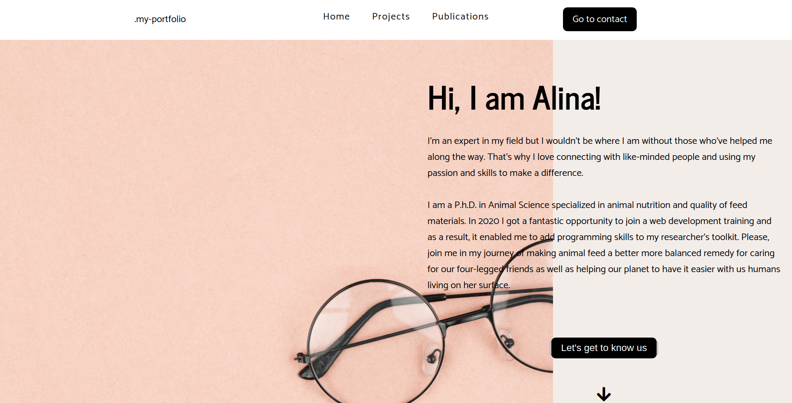

# portfolio-in-react :woman_office_worker

Update 2022

Let's get to know each other! A portfolio website of junior web developer made with :sparkling_heart: in ReactJS. With a tiny sustainable-nutrition blog feature. See you there!



# Getting Started with Create React App

## ReactJs

A JavaScript library to build web apps
what makes React so special

- Components
- State

# files in React

## manifest.json

The web app manifest provides information about an application (such as name, author, icon, and description) in a JSON text file

## reportwebvitals

Tool for measuring the real life performance of your app(very new to React)
more on that [web-vitals](https://www.npmjs.com/package/web-vitals)

## To start React Project

**Remember:**

- Don't foget before starting the project with npm start DON'T FORGET to cd app-name.
- "public" is the data for the published version
- "src" is with one is working with
- both .js and .jsx extensions work in react
- index.js should contain imports and ReactDOM.render() only

```bash
 npx create-react-app <app-name>
 cd <app-name>
 npm i node-sass
 npm start
```

## Deploy React apps in GH pages

### step 1

Installing gh-pages packages

```bash
npm install gh-pages
```

### step 2

Adding homepage into **package.json**

```json
"homepage": "http://<your-gh-username>.github.io/<your-repo-name>"
```

### step 3

Adding some more scripts into **package.json**

```json
"scripts": {
//...
"predeploy": "npm run build",
"deploy": "gh-pages -d build",
}
```

### step 4

Lastly run build script to generate build dir

```bash
npm rum build
npm run deploy
```

## To install fontawesome icons packages

```bash
 npm i --save @fortawesome/fontawesome-svg-core
 npm install --save @fortawesome/free-solid-svg-icons
 npm install --save @fortawesome/react-fontawesome
 npm install --save @fortawesome/free-brands-svg-icons
 npm install --save @fortawesome/free-regular-svg-icons
```

## To install react icons package

```bash
npm install react-icons --save
```

### To use fontawesome icons via Individual Use

Import icons into each component.

```jsx
 import { FontAwesomeIcon } from '@fortawesome/react-fontawesome'
 import { faCoffee } from '@fortawesome/free-solid-svg-icons'
 const element = <FontAwesomeIcon icon={faCoffee} />
 ReactDOM.render(element, document.body)
```

## Installing Router to handle links

```bash
 npm install react-router-dom
```

## Installing Bootstrap to handle cards

```bash
 npm install react-bootstrap bootstrap@5.0.1
```

## Scss style

### To install Scss style sheet

```bash
nmp init
npm install --save-dev live-server
npm install --save-dev saas gh-pages
```

### Edit the newly created package.json

```json
{
    "description": "Sass project",
    "author": "Alie"
}
```

### Defeault working directory structure

### Mixins

Mixin lets you to make groups of css declarations to resuse them throughout the site.

### Normalized scss style

```bash
npm install normalize-scss
```
